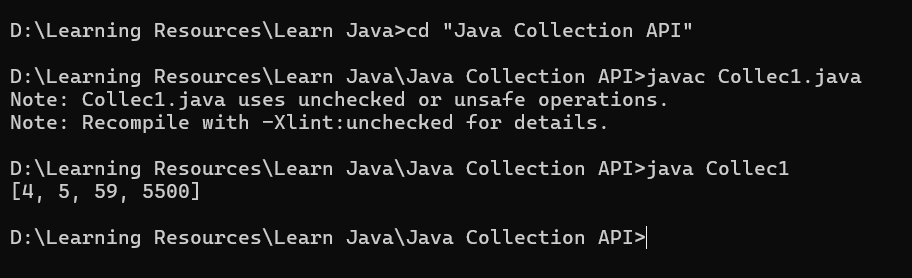

# Java Collection API 

Java Collection API was not a primary part of java during its release but was rather released in the later 2nd version as a concept.  

So what collections do is that they provide us a method to make a group of objects and store them together. So collection is a "concept of java" rather than some method or piece of code.  

To implement this concept of "Java Collections" we have something called Java Collection Framework   **a.k.a.     JCF**  

What is JCF??  
Well JCF is a framework that gives the user a design as well as defines a set of rules that can be used to enforce the concept of Java Collections. What is also provided along with it are classes and soem interfaces.  
It provides some interfaces (Rules or blueprint) such as :  
- List = *Ordered, Duplicates are allowed.*  
- Set = *No duplicates allowed.*  
- Queue = *FIFO*  

These rules, designs, classes, interfaces etc are used to perform operations such as managing , sorting, searching etc  
It also provides some implementations of these such as :  
- ArraList, LinkedList, HashSet, PriorityQueue etc.  
  
## Java  Collection API  

Java Collections API are used to make tasks simpler.....matlab??  
These are ready-made functions/methods that can be used diretly to perform otherwise impossible or complex tasks. 
  
*Refer Collec1.java*  
  
For clarifying again So Java Collection APIs are basically methods/functions that are bundled in form to make some features accessile easier...Sounds familiar right?  
Well its a package  
well other such as system, string etc are need not be inported *exclusively* but for these they need to be   
  

  
  
But where are they??  
Well in utils package so they can be imported by:  
```Java  
import java.utils.ArrayList;//for specific implementation  
import java.utils.*; //just bring all in  
```  

## ArrayList

What does array list do ?  
**It makes a dynamic sized array.**  
  

And what does this bring   
well change size in dynamic manner, we have to add using varname.add(value);, Also we can directly do this  
```Java
   ArrayList nums = new ArrayList();  
        nums.add(4);
        nums.add(5);
        ..
        ...
        System.out.println(nums);
```  
Well yes as you see I have successfully printed the array...*cough cough cough*... *Sorry* I have successfully printed the **ArrayList named nums**  
  
Result :  
  
  
And yes it also uses index like the og array but instead if direct method we nee to use a get function.  

refer below   
  

Well you may notice some warnings well that may be because as the type of arrayis no explicitly declared then we can use get to add almost anything whether it is string, double, float etc.  
And this may add to the confusion.  
Ideally it should be like below:  
```Java 
ArrayList<Integer> nums = new ArrayList<>(); // Only integers allowed

// nums.add("Hello"); // ❌ Error: type mismatch
```

This is a good methos to use frequently used methods.  
But while in our previous example did not take the type of ArrayList into consideration but we can as shown above 
Also, if type is not declared then the type of ArrayList is object thus if not defined all types of values can be added from 9,99, 99.99 to Aaditya etc. 

see below: 


So what is intersting is that as i said Arraylist is a bunch of classes and methods to simplify work so when i mean that i need to define type is that we can define anything as type for reference see below is snippet of og Arraylist class and we can see <E> in it the E here stands for custom reference meaning that it can be of anytype String , integer , obbject heck even of type class.  
  
  
what if i want ot print values one by one or in a conditional manner  then?   


So if you remember from snippet of ArrayList class in line next to class it was written :  
```Java
public class ArrayList<E> extends AbstractList<E>
        implements List<E>, RandomAccess, Cloneable, java.io.Serializable
```

meaning ArrayList has a interface named List and it has diferent features whuch you can just know by entering varname. and suggestions pop up 
  
To re- emphasize List is a Interface and As we have seen ArrayList is based on it So it at bare minimum level satisifies all basic conditions while having tweaks if its own.  
See Below,  
  
  
When you are not sure if you really want ArrayList you can just use List and then change later like  .....this  
```Java 
List<String> names = new ArrayList<>();
// later you can do
names = new LinkedList<>();
```

## Set  

Well this does ring a bell......from discrete maths to python... I have seen it every where so i can basically guess with my toes how this would behave.  

Well as expected just as it is in discrete maths  


Well there is also this  


Set is un-indexed and there is no var.get() method and it is also disordered meaming that it stores values in no particular sequence.  
Also interesting thing is that we used HashSet which is a extension of Set Interface which follows Collections similar to List which also follows collections but diffenrence is list stores vvalues in sequence in which they were added, can store duplicate values and can be indexed.  

## Map [ *Support Key and value pair in java*]

Maps are structures that support key value structure.  
You can use maps using   
```Java
Map <Key_Type, Value_Type> var_name = new HashMap<>();
```

here we use hashmap as this help us keep key value unique as hashmap internally uses Set.  
Also the type combo can be any thing String , String or Int, String....Just think all combos possible.
  

---
Done........