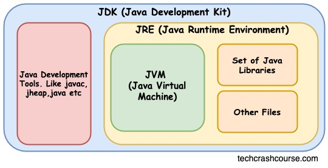
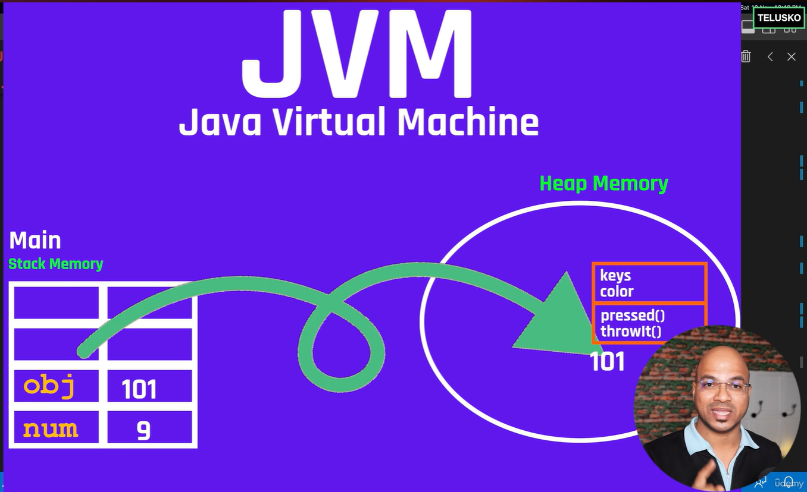
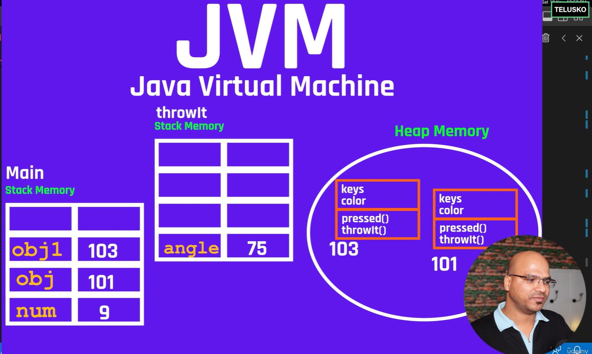
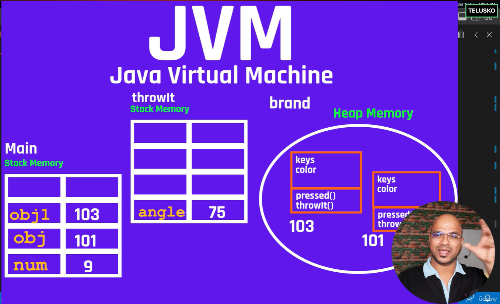

# Java Working

So, In this doc we will discuss the working of a Java Machine in Backend .
To run Java Programs you Initially download a kit from OpenJdk Or Oracle This is usually what we call a JDK meaning a Java Development Kit 

this JDK containd 2 things that help it develop applications
- *JRE- Java Runtime Environment.*
- *Java Virtual Machine.*




When we Say that Java is a WORA (Write One Run Anywhere) Language JVM is the one that is performing the magic.
JVM usually has everything You need to run your application But sometimes some external files such as Libraries are necessary These are usually provided by the  **JRE**

## JVM - Java Virtual Machine

- Inside the JVM we have multiple areas or multiple parts 
in it we have Heap memory and Stack memory 


- Whenever a method is created or called a **Stack** is created that method say you make a main( ) method and a push method( ) then 2 stacks main & push will be made.
- And so The local variables that are made are thus pushed into that stack so if variables a, b, c are declared inside the method main then they will be put in that stack.

```java
class Demo
{
    public static void main(String args[])
    {
        int num= 9;
    }
}
```
So if you observe above example then when above code is run then  a stack **main**
will be made and it will have a variable num = 9 in it.

like wise let us see what happens when you create a object.

```Java
class Keyboard
{
    int keys;
    String color;
    
    public void pressed()
    {
        System.out.println("Signal sent"+color);
    }

    public void throwit()
    {
        int angle = 75
        System.out.println("Got hit");
    }
}

class Demo
{
    public static void main(String args[])
    {
        int num= 9;

        Keyboard obj = new Keyboard();
        obj.pressed();
        obj.throwit();
    }
}
```

so when a object is made 
in this line 
```JAVA
Keyboard obj = new Keyboard;
```
what we are saying to the compiler is that make a variable **obj** of **type = Keyboard** 
Here,
- obj = reference variable.
- Keyboard *(first one)* - is the class name *(the class is a reference data type)*. It defines the structure and behavior of objects of the type keyword.This class must be defined elsewhere in your code or imported
- new = it is a special keyword that tells the jvm that a object is to be created in the *heap* memory.
- Keyword( ) = this calls the constructor of the Keyword class to initialize the object.

now this object created means that all its methods and values are initialized in the heap and then in the stack a variable is created which is *obj* in our case along with it is also stored the address of memory where the initialized object's methods and values are placed. *[in given example 101 represents the memory address.]*

***Pls refer the below image for reference***



so here,
```Java
obj.pressed();
obj.throwit();
```
what we are doing is that we are using the initialized methods that are present in the *heap memory* for a particular object by accessing them using the corresponding address value stored in the *stack*.

So what happens when we make a new object and use it to call the methods.

So in this case we can see that  the new object is also initialized in the stack and also corresponding methods and var are initialized also for methods new stack are created.

***Refer Below Image***



```java
 public static void main(String args[])
    {
        int num= 9;

        Keyboard obj = new Keyboard();
        obj.pressed();
        Keyboard obj1 = new Keyboard();
        obj1.throwit();
    }
```

***So as we can see that every Object will have its own memory for saving about the instance variable.***

 *So we can set obj.keys= 100 and obj1.keys= 150 in such case same var key can have different value in memory depending on the obj it is accessed through*

 **So is there any method using which we can make sure that there exists a variable that give similar value irrespective of the object??**

so what we can do is that we can declare that particular variable as **static** then this var will not be initialized in heap and will be rather present in another  type of  memory and  will be accessible to all and in same value.



```Java
class Keyboard
{
    int keys;
    String color;
    Static String brand="Aadi";
..
..
..//rest same as above/previous code
.
}

class Demo{
..
..
..

    Keyboard obj = new Keyboard();
        obj.pressed();
        obj.throwit();
    System.out.println("Printing Static Variable"+Keyboard.brand);
..
..//rest same as earlier.
..
}
```

So as we can see that unlike instance variables that can only be accessible via object [as they are initialized in heap memory only when object is created] 

*Static variables* are present elsewhere in the memory so the can be directly accessed like done here:

```Java 
System.out.println("Printing Static Variable"+Keyboard.brand);
```

So while above works while below is **an error**

```java
System.out.println(Keyboard.keys);
```

***This happens because Static Variables are directly accessible using class name. That's the reason that the main method of a class is always static else to access main we would have to create an object of class. But as we know that main is the starting point of execution***

**So** 
**NO OBJECT ---> WE CAN'T CALL MAIN** 

**CANNOT CALL MAIN----> HOW TO CREATE OBJECT**

*THUS WE END UP IN A DEADLOCK*


<details>
<summary>To Remember
</summary>

- Every Instance Variable will have a copy in the heap memory

- But Local Variable go into stack

- While the static variable are not stored in the heap or objects but will be in a seperate memory 

- Every time we complie a java file it will make a class file.  How many class files?? ---> depends on the number of classes like above code we made would result in a **Demo.class** as well as **Keyboard.class**

- so what we write is a .java file on compilation it gives out a .class file which is otherwise a bytecode which the goes to the JVM and thus making Java Platform Independent Language as the bytecode can be ran by all JVM's irresepective of their Operating Systems


</details>


---

## Bye.... ≧◡≦